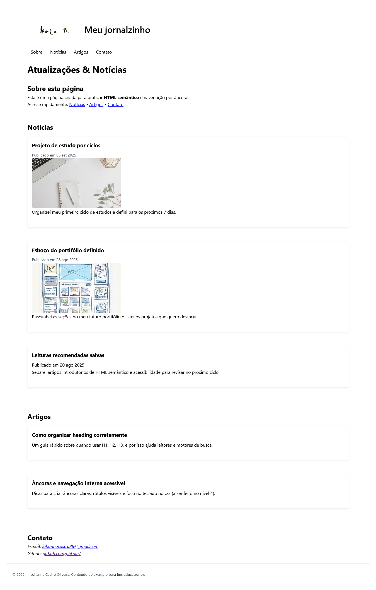

# Módulo 1 · Projeto 1 · Nível 3 — Página de Notícias

Este projeto faz parte do meu ciclo de estudos em **front-end**.  
O objetivo é praticar **HTML semântico** e **CSS básico** (sem frameworks), criando uma página simples de notícias e artigos.

---

## ✨ Funcionalidades implementadas

- Estrutura semântica com `<header>`, `<main>`, `<section>`, `<article>`, `<footer>`.
- Navegação por âncoras (`#sobre`, `#noticias`, `#artigos`, `#contato`).
- Cabeçalho fixo (sticky header) com logotipo e menu.
- Listas de notícias e artigos organizadas em `<ul>` e `<li>`.
- Imagens representativas (`.thumb`) com `alt` descritivo.
- Rodapé com informações de contato e direitos autorais.

---

## 🎨 Estilos aplicados

- Reset de espaçamento e `box-sizing: border-box`.
- Fonte padrão do sistema (`system-ui`).
- Layout centralizado com largura máxima (`max-width: 1200px`).
- Header fixo com fundo branco e borda inferior.
- Rolagem suave entre âncoras (`scroll-behavior: smooth`).
- Estrutura de lista sem bullets (`.list`).
- Imagens em miniatura com borda e cantos arredondados.

---

## Prints da Página

### Página inicial

---

## PDFs

Todos os PDFs relacionados a este projeto estão na pasta `docs/`:

- [Guia do exercício P1-N1-N3](<docs/M1%20•%20P1%20(exercício%20Tradicional)%20•%20Nível%203%20—%20Guia%20do%20exercício.pdf>)

---

## 🚀 Próximos passos

- [ ] Adaptar o layout para **mobile-first** (responsividade).
- [ ] Estilizar os artigos como **cards** com `box-shadow` e `padding`.
- [ ] Criar estados de foco/hover acessíveis para links.
- [ ] Melhorar contraste e paleta de cores.

---

## 📝 Licença

Projeto criado apenas para fins educacionais.  
© 2025 — Lohanne Castro Oliveira
